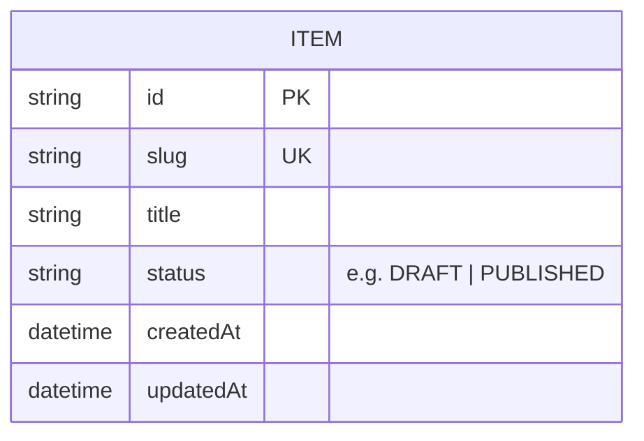

# Domain Model

The {{PROJECT_NAME}} domain as an entity-relationship model. Derived from the
persistence layer / [`../spec/README.md` §3 Domain Concepts](../spec/README.md#3-domain-concepts).

Each **aggregate root** — an entity with an independent lifecycle — gets one
file. The full ERD below must include every aggregate as an entity; each
per-aggregate file diagrams its own entity. (`validate.py` enforces both.)

Aggregate roots:

- [`item.md`](./item.md) — **Item** — *EXAMPLE, replace/delete*

> TODO(agent): list your aggregates here and add one file per aggregate,
> copying `_TEMPLATE.md`. Delete the `Item` example once real ones exist.

## Full ERD

> TODO(agent): add every aggregate as an entity and draw the relationships
> (crow's-foot cardinality) between them.

## Legend

- **PK** primary key · **UK** unique key · **FK** foreign key.
- Crow's-foot: `||` exactly one · `|o` zero-or-one · `o{` zero-or-many ·
  `}o--o{` many-to-many.
- "nullable" marks optional attributes.
