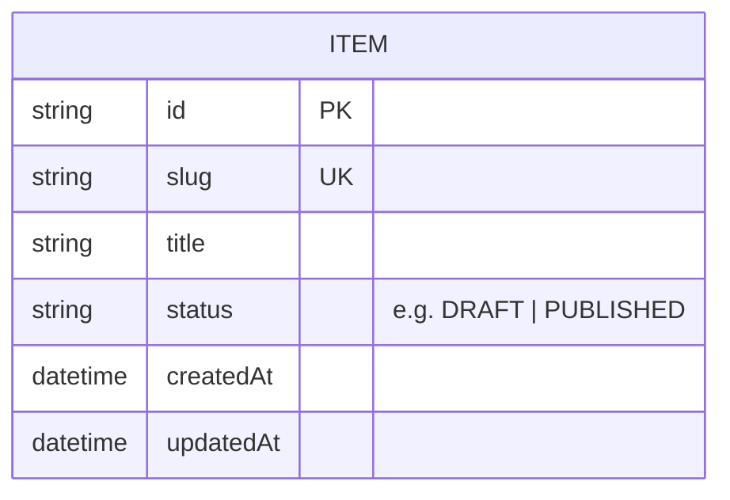

# domain/

The domain as an entity-relationship model. Each **aggregate root** (an entity
with its own lifecycle) gets one file; this overview ERD must include every
aggregate, and each file diagrams its own entity (`../validate.py` enforces
both). Copy [`item.md`](./item.md) as the pattern.

## Overview ERD

## Legend

- **PK** primary key · **UK** unique key · **FK** foreign key.
- Crow's-foot: `||` one · `|o` zero-or-one · `o{` zero-or-many · `}o--o{` many-to-many.
