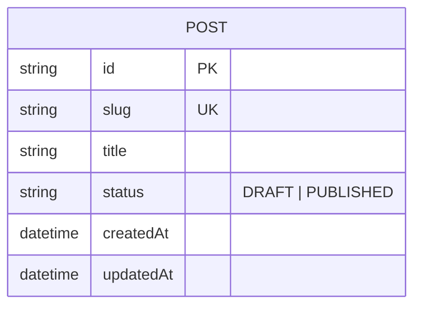

# Post — aggregate root

The central unit of content the app manages. See the [full ERD](./README.md).

## Attributes

| Field | Type | Optional | Notes |
|---|---|---|---|
| `id` | string | — | PK |
| `slug` | string | — | Unique, URL-safe |
| `title` | string | — | Display title |
| `status` | enum | — | `DRAFT` or `PUBLISHED` |
| `createdAt` / `updatedAt` | datetime | — | Timestamps |

## Relations

- None in this example (a single-entity domain).

## Invariants & rules

- `slug` is unique and URL-safe.
- Drafts are private; only published posts are publicly readable.
